<!-- Project Header -->

	<a href="https://johng.io" title="John's Portfolio">
		<picture>
			<source media="(prefers-reduced-motion)" srcset="public/logo/static.svg" />
			
		</picture>
	</a>

## 👋 About

I am a recent graduate from the University of Alberta with a Bachelors Specialization in Computing Science. During my time at the U of A, I had the opportunity to share my expertise with Haemonetics Corporation in Edmonton, where I was involved in end-to-end development of their NexLynk Donor Management System.

Having a natural interest in technology has allowed me to gain experience with many different aspects of software development, like cloud computing, web design, and low-level programming with Arduino and MIPS assembly. Although I am a versatile full-stack developer, I have a particular interest in building performant, privacy-focused, and accessible client side web applications using modern web technologies. If you think I might be a good fit for your team, feel free to [reach out].

Some of my extracurricular interests include cycling, listening to music, petting small animals, and contributing to open-source software. If you're interested, you can find some of my work below :)

## 💼 My Work

| [👤 twocaretcat](https://github.com/twocaretcat)   | [🤝 Caret Collective](https://github.com/caret-collective) | [🧪 Caret Labs](https://github.com/caret-labs-co) |
| :------------------------------------------------- | :--------------------------------------------------------- | :------------------------------------------------ |
| Forks, experiments, and personal/academic projects | Community-driven open-source projects                      | Commercial and client work                        |

## 📈 Stats

<a title="Github Stats">
	<picture>
		<source media="(prefers-color-scheme: light)" srcset="public/cards/stats-light.svg" />
		
	</picture>
</a>
<a title="Most Used Languages">
	<picture>
		<source media="(prefers-color-scheme: light)" srcset="public/cards/top-langs-light.svg" />
		
	</picture>
</a>

## 💬 Languages

<kbd>Bash</kbd>
<kbd>C/C++</kbd>
<kbd>CSS</kbd>
<kbd>Datalog</kbd>
<kbd>GraphQL</kbd>
<kbd>HTML</kbd>
<kbd>Java</kbd>
<kbd>JavaScript/TypeScript</kbd>
<kbd>JSX/TSX</kbd>
<kbd>Kotlin</kbd>
<kbd>Liquid Template Language</kbd>
<kbd>Lisp</kbd>
<kbd>Lua</kbd>
<kbd>MIPS Assembly</kbd>
<kbd>Nix</kbd>
<kbd>Python</kbd>
<kbd>R</kbd>
<kbd>Regular Expressions</kbd>
<kbd>SASS/SCSS</kbd>
<kbd>SQL</kbd>
<kbd>VBA</kbd>

## 🛠️ Technologies

<a href="https://astro.build/" rel="external"><kbd>Astro</kbd></a>
<a href="https://avajs.dev/" rel="external"><kbd>AVA</kbd></a>
<a href="https://bun.sh/" rel="external"><kbd>Bun</kbd></a>
<a href="https://developer.nvidia.com/cuda-zone" rel="external"><kbd>CUDA</kbd></a>
<a href="https://www.cypress.io/" rel="external"><kbd>Cypress</kbd></a>
<a href="https://deno.com/" rel="external"><kbd>Deno</kbd></a>
<a href="https://www.djangoproject.com/" rel="external"><kbd>Django</kbd></a>
<a href="https://www.docker.com/" rel="external"><kbd>Docker</kbd></a>
<a href="https://www.electronjs.org/" rel="external"><kbd>Electron</kbd></a>
<a href="https://expressjs.com/" rel="external"><kbd>Express.js</kbd></a>
<a href="https://fastapi.tiangolo.com/" rel="external"><kbd>FastAPI</kbd></a>
<a href="https://firebase.google.com/" rel="external"><kbd>Firebase</kbd></a>
<a href="https://www.gatsbyjs.com/" rel="external"><kbd>GatsbyJS</kbd></a>
<a href="https://git-scm.com/" rel="external"><kbd>Git</kbd></a>
<a href="https://gulpjs.com/" rel="external"><kbd>Gulp</kbd></a>
<a href="https://jekyllrb.com/" rel="external"><kbd>Jekyll</kbd></a>
<a href="https://jestjs.io/" rel="external"><kbd>Jest</kbd></a>
<a href="https://joi.dev/" rel="external"><kbd>Joi</kbd></a>
<a href="https://www.oracle.com/java/technologies/jspt.html" rel="external"><kbd>JSP</kbd></a>
<a href="https://junit.org/" rel="external"><kbd>JUnit</kbd></a>
<a href="https://kubernetes.io/" rel="external"><kbd>Kubernetes</kbd></a>
<a href="https://nextjs.org/" rel="external"><kbd>Next.js</kbd></a>
<a href="https://nodejs.org/" rel="external"><kbd>Node.js</kbd></a>
<a href="https://numpy.org/" rel="external"><kbd>NumPy</kbd></a>
<a href="https://www.oracle.com/database/" rel="external"><kbd>Oracle DB</kbd></a>
<a href="https://parceljs.org/" rel="external"><kbd>Parcel</kbd></a>
<a href="https://postcss.org/" rel="external"><kbd>PostCSS</kbd></a>
<a href="https://www.postgresql.org/" rel="external"><kbd>PostgreSQL</kbd></a>
<a href="https://pptr.dev/" rel="external"><kbd>Puppeteer</kbd></a>
<a href="https://react.dev/" rel="external"><kbd>React.js</kbd></a>
<a href="https://www.solidjs.com/" rel="external"><kbd>SolidJS</kbd></a>
<a href="https://spring.io/projects/spring-framework" rel="external"><kbd>Spring Framework</kbd></a>
<a href="https://www.sqlite.org/" rel="external"><kbd>SQLite</kbd></a>
<a href="https://tailwindcss.com/" rel="external"><kbd>Tailwind CSS</kbd></a>
<a href="https://vitejs.dev/" rel="external"><kbd>Vite</kbd></a>
<a href="https://vuejs.org/" rel="external"><kbd>Vue.js</kbd></a>
<a href="https://webpack.js.org/" rel="external"><kbd>Webpack</kbd></a>
<a href="https://zod.dev/" rel="external"><kbd>Zod</kbd></a>

## 📬 Contact

Need to get in touch? Give me a shout at [johng.io/contact][reach out].

You can also find me on:

- [LinkedIn](https://www.linkedin.com/in/johngoodliff/)
- [X](https://x.com/twocaretcat)
- [Patreon](https://patreon.com/c/twocaretcat)

[reach out]: https://johng.io/contact
